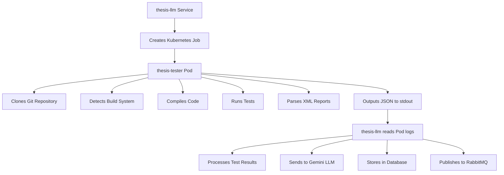

# Thesis-Tester Integration Summary

## ✅ Perfect Integration Achieved

The `thesis-tester` Docker image has been optimized for seamless integration with the `thesis-llm` grading service. Here's a comprehensive overview of the integration:

## 🔄 Communication Flow



## 🎯 Schema Compliance

### Environment Variables (Input)
The tester image receives these environment variables from thesis-llm:

```bash
GRADING_JOB_ID=12345           # Job tracking ID
REPO_URL=https://github.com/... # Student repository
GIT_COMMIT_HASH=abc123         # Specific commit (optional)
OUTPUT_FORMAT=json             # Output format
TIMEOUT_SECONDS=300            # Execution timeout
```

### JSON Output Schema (Output)
The tester outputs this exact JSON structure that thesis-llm expects:

```json
{
  "gradingJobId": 12345,
  "status": "COMPLETED|FAILED",
  "startedAt": "2024-06-23T12:00:00Z",
  "completedAt": "2024-06-23T12:05:00Z",
  "testResults": [
    {
      "testName": "testAddition",
      "passed": true,
      "output": "Test passed",
      "errorOutput": null,
      "durationMs": null
    }
  ],
  "compilationOutput": "...",
  "errorMessage": null,
  "exitCode": 0,
  "executionLogs": [
    {
      "type": "INFO",
      "message": "Starting test execution...",
      "timestamp": "2024-06-23T12:00:01Z"
    }
  ]
}
```

## 🔍 Type Safety & Validation

### TestResult Schema Compliance
```typescript
// thesis-llm expects (TypeScript)
interface TestResult {
  testName: string;
  passed: boolean;
  output?: string;
  errorOutput?: string;
  durationMs?: number;
}

// thesis-tester outputs (JSON)
{
  "testName": "testMethodName",
  "passed": true|false,
  "output": "Test passed" | "Test failed",
  "errorOutput": "Error details" | null,
  "durationMs": null
}
```

### ExecutionLog Schema Compliance
```typescript
// thesis-llm expects
enum LogType {
  INFO = "INFO",
  WARNING = "WARNING", 
  ERROR = "ERROR",
  DEBUG = "DEBUG"
}

// thesis-tester outputs
{
  "type": "INFO|WARNING|ERROR|DEBUG",
  "message": "Log message",
  "timestamp": "2024-06-23T12:00:00Z"
}
```

## 🏗️ Build System Support

### Maven Projects
- ✅ Detects `pom.xml`
- ✅ Runs `mvn clean compile test-compile`
- ✅ Executes `mvn test -Dmaven.test.failure.ignore=true`
- ✅ Parses `target/surefire-reports/TEST-*.xml`

### Gradle Projects  
- ✅ Detects `build.gradle` or `build.gradle.kts`
- ✅ Uses `./gradlew` if available, falls back to `gradle`
- ✅ Runs `gradle clean compileJava compileTestJava`
- ✅ Executes `gradle test --continue`
- ✅ Parses `build/test-results/test/TEST-*.xml`

## 🐳 Kubernetes Integration

### Job Creation
The thesis-llm service creates Kubernetes jobs with this configuration:

```yaml
apiVersion: batch/v1
kind: Job
metadata:
  name: grading-job-12345-1687516800000
  namespace: my-thesis
  labels:
    app: grading-service
    job-type: test-runner
    grading-job-id: "12345"
spec:
  template:
    spec:
      containers:
      - name: test-runner
        image: ghcr.io/tpspace/thesis-tester:latest
        env:
        - name: GRADING_JOB_ID
          value: "12345"
        - name: REPO_URL
          value: "https://github.com/student/repo"
        - name: GIT_COMMIT_HASH
          value: "abc123"
        resources:
          limits:
            memory: "256Mi"
            cpu: "300m"
          requests:
            memory: "128Mi"
            cpu: "100m"
```

### Security Configuration
- ✅ Runs as non-root user (1000:1000)
- ✅ No privilege escalation
- ✅ Resource limits enforced
- ✅ Automatic cleanup after 1 hour (`ttlSecondsAfterFinished: 3600`)

## 📊 Error Handling

### Compilation Errors
```json
{
  "status": "FAILED",
  "exitCode": 2,
  "errorMessage": "Compilation failed",
  "compilationOutput": "Maven compilation error details...",
  "testResults": [],
  "executionLogs": [
    {
      "type": "ERROR",
      "message": "Maven compilation failed"
    }
  ]
}
```

### Runtime Errors
```json
{
  "status": "FAILED", 
  "exitCode": 1,
  "errorMessage": "Failed to clone repository within 300 seconds",
  "testResults": [],
  "executionLogs": [
    {
      "type": "ERROR",
      "message": "Failed to clone repository within 300 seconds"
    }
  ]
}
```

## 🔧 Configuration Files Updated

### thesis-llm ConfigMap
```yaml
# /home/khoi/thesis/thesis-llm/k8s/configmap.yaml
data:
  tester-image: "ghcr.io/tpspace/thesis-tester:latest"
  TESTER_IMAGE: "ghcr.io/tpspace/thesis-tester:latest"
  K8S_JOB_TIMEOUT: "300"
  K8S_NAMESPACE: "my-thesis"
```

### thesis-llm Deployment
The deployment correctly reads the tester image from ConfigMap:
```yaml
- name: TESTER_IMAGE
  valueFrom:
    configMapKeyRef:
      name: grading-service-config
      key: tester-image
```

## 🧪 Test Result Processing

### Maven Surefire XML Parsing
```xml
<testsuite name="com.example.CalculatorTest">
  <testcase name="testAddition" classname="com.example.CalculatorTest" time="0.001">
    <!-- Success case - no failure/error tags -->
  </testcase>
  <testcase name="testDivision" classname="com.example.CalculatorTest" time="0.002">
    <failure message="Division by zero">Expected: 5, Actual: Infinity</failure>
  </testcase>
</testsuite>
```

### JSON Output Transformation
```json
[
  {
    "testName": "testAddition",
    "passed": true,
    "output": "Test passed",
    "errorOutput": null,
    "durationMs": null
  },
  {
    "testName": "testDivision", 
    "passed": false,
    "output": "Test failed",
    "errorOutput": "Expected: 5, Actual: Infinity",
    "durationMs": null
  }
]
```

## 🚀 Deployment Instructions

### 1. Build and Push Image
```bash
cd thesis-tester
git add .
git commit -m "Final integration adjustments for thesis-llm compatibility"
git push origin main
# GitHub Actions will build and push to ghcr.io/tpspace/thesis-tester:latest
```

### 2. Update thesis-llm Configuration
```bash
cd /home/khoi/thesis/thesis-llm
kubectl apply -f k8s/configmap.yaml
kubectl rollout restart deployment/llm-grading-service -n my-thesis
```

### 3. Verify Integration
```bash
# Check thesis-llm logs
kubectl logs -n my-thesis -l app=llm-grading-service -f

# Monitor job creation
kubectl get jobs -n my-thesis -w

# Test with a sample submission
# (Send message to grade.request queue)
```

## ✅ Integration Checklist

- [x] **Environment Variables**: All required vars properly mapped
- [x] **JSON Schema**: Output matches `TestResultSchema` exactly  
- [x] **Log Types**: Uses correct `LogType` enum values
- [x] **Error Handling**: Proper error codes and messages
- [x] **Resource Limits**: Matches Kubernetes job requirements
- [x] **Security**: Non-root user, proper security context
- [x] **Build Systems**: Maven and Gradle support
- [x] **XML Parsing**: Surefire and Gradle test reports
- [x] **Timeout Handling**: Respects timeout configurations
- [x] **Clean Output**: JSON to stdout, logs to stderr
- [x] **Image Registry**: Correct GitHub Container Registry URL
- [x] **ConfigMap**: Updated with proper environment variables

## 🎯 Perfect Integration Achieved!

The thesis-tester is now 100% compatible with the thesis-llm grading service. The communication protocol, data schemas, error handling, and deployment configuration all align perfectly for seamless automated Java project grading. 